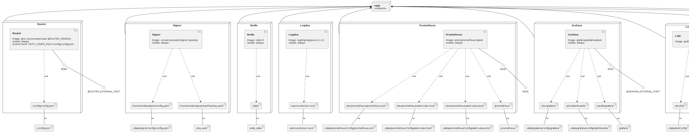

# Router Docker Compose

Production-ready docker-compose for Connext routers.

## Router Setup Using docker-compose

### Requirements

- [ Docker CE (Community Edition) ](https://docs.docker.com/install/) version 20.10.5 or higher
- [ Docker Compose ](https://docs.docker.com/compose/install/) version 1.27.4 or higher

### Run docker-compose Stack

1. Clone repo

```
cd ~
git clone https://github.com/connext/router-docker-compose.git
```

2. Rename file `.env.example` to `.env` and modify it. You need to set next environment variables:

- `ROUTER_VERSION` - version to use, images found here: https://github.com/connext/nxtp/pkgs/container/router

Note: Do not use `:latest` tag! This will not be stable as we are constantly updating! Find the latest [Amarok release](https://github.com/connext/nxtp/releases) and use the version semver tagged, i.e. `0.2.1-beta.10`.

3. Go through `docker-compose.yml` and change any of the externally mapped ports if those ports do not work with your host configuration.

4. Create configuration file `~/router-docker-compose/config.json, it will be mounted into router container. Use the `config.example.json` for guidance on what config items to change/modify. At minimum, please add your own paid RPC providers to the `providers` array for each chain, and verify the assets for the desired chains. See [Connext docs](https://docs.connext.network/Routers/Reference/configuration/) for configuration description.

5. Rename file `key.example.yaml` to `key.yaml` and modify it. Web3Signer yaml key file `~/router-docker-compose/key.yaml` will be mounted into the signer container. Example file uses raw unencrypted files method. See [Web3Signer docs](https://docs.web3signer.consensys.net/en/22.5.1/HowTo/Use-Signing-Keys/). 
And for more custom commands of web3signer, edit `~/router-docker-compose/data/signerConfig/config.yaml`. Refer [Web3Signer Command docs](https://docs.web3signer.consensys.net/en/22.5.1/Reference/CLI/CLI-Syntax/)


7. Create docker-compose services, volumes and network.

```
cd ~/router-docker-compose
docker-compose create
```

6. Run docker-compose stack.

```
docker-compose up -d
```

7. Check the status.

```
docker-compose ps
OR
docker ps -a
```

8. Check the logs.

```
docker-compose logs
OR
docker-compose logs router
```

You can also use these commands.

```
docker logs router
```

9. Stop and delete containers.

```
docker-compose down
```

## Other Tasks

### Restart Stack

```
docker-compose restart
```

### Update Version

1. Modify `.env` to change `ROUTER_VERSION`
2. Update stack

```
docker-compose pull
docker-compose up -d
```


### Infrastructure model


